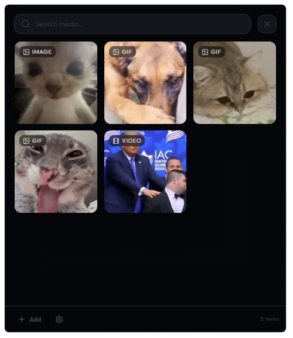

<div align="center">

# AttachBox

**A quick media board for your desktop.** Summon it with a hotkey, pick an image or video, and paste it instantly.



</div>

---

## ✨ Features

- **Hotkey Summoning** — Press a global shortcut to open AttachBox at your cursor position
- **Instant Paste** — Select any media and it gets copied to clipboard + auto-pasted
- **Media Support** — Images, GIFs, and videos with live preview thumbnails
- **Smart Storage** — Files are stored locally with configurable storage location
- **Silent Video → GIF** — Videos without audio are automatically treated as GIFs
- **URL Import** — Paste a URL to download and import media directly
- **Drag & Drop** — Drop files onto the upload modal to import
- **Search** — Filter your media library instantly
- **System Tray** — Runs quietly in the background, always one shortcut away

## 🛠 Tech Stack

| Layer            | Technology                      |
| ---------------- | ------------------------------- |
| Framework        | [Tauri v2](https://tauri.app)   |
| Frontend         | React 19 + TypeScript           |
| Styling          | Tailwind CSS v4                 |
| Animations       | Framer Motion                   |
| State            | tauri-plugin-store (persistent) |
| Backend          | Rust                            |
| Media Processing | FFmpeg (sidecar)                |
| Bundler          | Vite 7                          |
| Package Manager  | Bun                             |

## 📦 Getting Started

### Prerequisites

- [Bun](https://bun.sh) (or Node.js)
- [Rust](https://rustup.rs)
- [Tauri v2 prerequisites](https://v2.tauri.app/start/prerequisites/)

### Development

```bash
# Install dependencies
bun install

# Run in development mode
bun run tauri dev
```

### Build

```bash
# Create production build
bun run tauri build
```

The installer will be generated in `src-tauri/target/release/bundle/`.

## ⚙️ Configuration

Open settings from the bottom bar gear icon:

| Setting              | Description                                                  |
| -------------------- | ------------------------------------------------------------ |
| **Global Shortcut**  | Choose which key summons AttachBox (F1-F12, End, Home, etc.) |
| **Storage Location** | Where your media files are stored on disk                    |
| **Auto-Paste**       | Toggle automatic Ctrl+V simulation after selecting media     |

## 📁 Project Structure

```
attachbox/
├── src/                    # React frontend
│   ├── components/         # UI components (MediaCard, etc.)
│   ├── pages/              # Gallery, Settings, Upload pages
│   ├── lib/                # Utilities & Tauri API bindings
│   └── types/              # TypeScript type definitions
├── src-tauri/              # Rust backend
│   ├── src/
│   │   ├── lib.rs          # App setup, tray, shortcuts, file watcher
│   │   ├── commands.rs     # Tauri IPC commands
│   │   ├── media.rs        # Media management & file operations
│   │   ├── clipboard.rs    # Clipboard & paste simulation
│   │   └── models.rs       # Data structures
│   └── capabilities/       # Tauri v2 permissions
└── preview.png
```

## License

MIT
